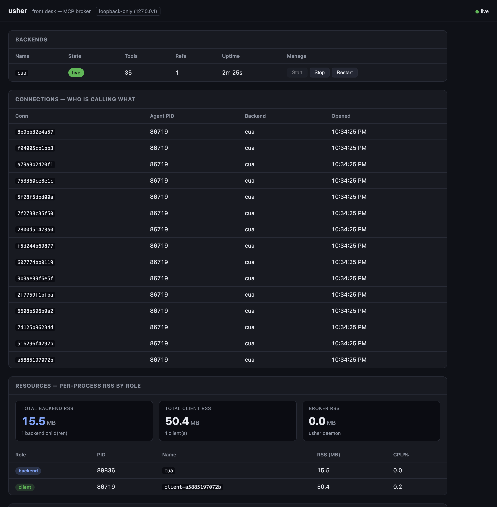
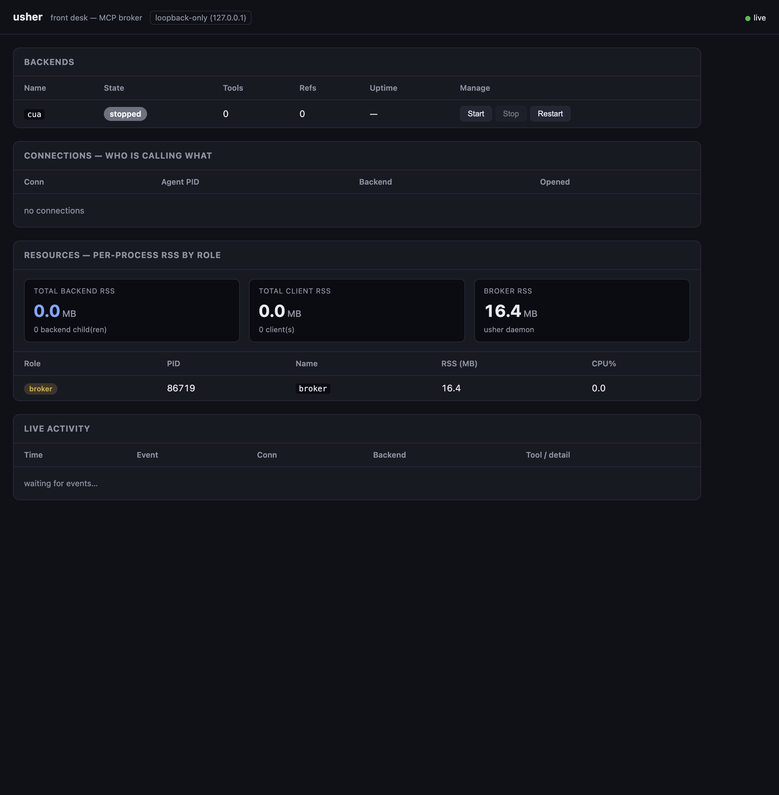

export const meta = {
  headline: "~14.9× less backend memory",
  brokerBackendRSS_MB: 15.5,
  directBackendRSS_MB: 230.6,
  clients: 15,
  perProcess: true,
}

# usher — does the broker actually save resources?

> **TL;DR.** With 15 agents driving the same backend, routing them **through usher**
> used **15.5 MB** of backend memory (one shared `cua` child). Letting each agent
> spawn its **own** backend used **230.6 MB** (fifteen `cua` children). Same work,
> **~14.9× less backend RAM** — and the curve stays *flat* as agents are added
> instead of climbing linearly. Measured **per process**, never as a system total.

---

## Why this test exists

`usher` is an MCP broker — a "front desk" that sits between AI agents and the MCP
tool servers they drive. Its central design bet is a **shared backend pool**: many
agent connections are multiplexed onto **one** long-lived backend child, instead of
each agent spawning a private copy.

The question this report answers is the obvious one: **does that actually pay off,
and by how much?** The failure mode it guards against is the everyday one —

> "I spin up 15 agents and memory spikes. I don't know what's using it."

So the test measures memory **attributed to specific processes by PID** (RSS +
CPU%, tagged `client` / `broker` / `backend`). A whole-system memory number is
deliberately *not* the metric — it can't tell you *which* process grew.

## Experiment design

Two arms, identical work (a real MCP `initialize` + repeated `tools/call
get_screen_size`), swept over **N = 1 … 15** synthetic client-agents:

| Arm | Topology | What we expect |
|-----|----------|----------------|
| **direct** (no broker) | each client spawns its **own** `cua-driver` child (1:1) | backend RAM grows ~linearly with N |
| **broker** | all clients connect through `usher` → **one shared** `cua` child | backend RAM stays flat |

Each arm samples every relevant PID once per tick via a single batched
`ps -o pid=,rss=,%cpu= -p <csv>` call (dep-free), and reports **per-process** RSS,
plus per-role totals. The harness lives at [`bench/loadtest`](../../bench/loadtest).

## Results

### The headline

```
BACKEND RSS:  broker = 15.5 MB  (1 shared cua child)
              direct = 230.6 MB (15 private cua children)
              ────────────────────────────────────────────
              ~14.9× reduction · flat vs linear
```

### Growth curve (the whole story)

**direct** — every added agent is another full backend process:

| N | Backend RSS | Backend children |
|--:|------------:|-----------------:|
| 1 | 15.3 MB | 1 |
| 2 | 30.8 MB | 2 |
| 3 | 46.1 MB | 3 |
| 5 | 76.7 MB | 5 |
| 10 | 153.6 MB | 10 |
| 15 | **230.6 MB** | **15** |

**broker** — every added agent is just another connection onto the same child:

| N | Backend RSS | Backend children | Client (harness) RSS |
|--:|------------:|-----------------:|---------------------:|
| 1 | 15.2 MB | 1 | 21.5 MB |
| 2 | 15.5 MB | 1 | 21.6 MB |
| 5 | 15.5 MB | 1 | 26.1 MB |
| 10 | 15.5 MB | 1 | 35.4 MB |
| 15 | **15.5 MB** | **1** | 45.4 MB |

Direct climbs **~15.4 MB per agent**. Broker is **flat** — the shared child does not
grow as connections are added; only the (single) client process holds more
connection state.

### Per-process breakdown at N=15 (per-PID, never system-total)

**direct arm** — 15 backends, individually accounted:

```
ROLE     PID    LABEL    RSS_MB  CPU%  ALIVE
broker   89471  harness  14.2    0.0   yes
backend  89472  cua#1    15.4    0.0   yes
backend  …      cua#2…15 ~15.4   0.0   yes   (each child listed individually)
────────────────────────────────────────────
totals:  backend = 230.6 MB (15 children) · client = 0.0 MB
```

**broker arm** — one backend serving everyone:

```
ROLE     PID    LABEL   RSS_MB  CPU%  ALIVE
backend  89836  cua     15.5    0.0   yes
client   86719  client  50.4    0.2   yes
────────────────────────────────────────────
totals:  backend = 15.5 MB (1 child) · client = 50.4 MB
```

`usher`'s own idle daemon overhead is **~16.4 MB** — a fixed, one-time cost that the
shared-backend savings dwarf the moment more than one agent is involved.

## Seeing it live

The broker watched itself the whole time. Below, the dashboard during a 20-second
hold at N=15: `cua` is **live** with **refs=15**, the *who-is-calling-what* panel
lists all **15 distinct connection IDs** pointed at one backend, and the RESOURCES
panel reads **TOTAL BACKEND RSS 15.5 MB / 1 child**.



At idle, before any agent connects, the backend is **stopped** (lazy start) and
backend RSS is **0 MB**:



## Robustness

- **Mux held 15 concurrent clients** on one child — no id-crossing, no handshake
  corruption, no dropped/duplicated responses.
- **No leaks.** The direct arm's post-run liveness sweep was clean (all 15 children
  gone); stopping the daemon reaped its single shared child. Final `ps`: zero
  `usher`-spawned processes remaining.
- Two pre-existing, unrelated `cua` processes on the machine were identified and
  left untouched.

## Honest caveats

These are reporting/attribution quirks, **not** bugs in the broker — and they do not
touch the backend-RSS headline (the actual thesis).

1. **Dashboard "client count" reads 1, not 15.** All 15 synthetic clients run inside
   one harness *process* (one PID), and the sampler dedupes by PID — correct
   per-process accounting. The 15 agents show up in the CONNECTIONS panel
   (15 connection IDs, `refs=15`), not in the per-role client *count*.
2. **Broker RSS rolls up as 0.0 in the broker arm.** Over the Unix socket the
   client's peer-PID can resolve to the daemon's own PID, folding usher's ~16 MB
   into the client row. Cosmetic peer-PID attribution; the backend comparison is
   unaffected.
3. Per-role PID attribution on `/api/resources` requires `USHER_SAMPLE=1` in the
   daemon's environment.

## Reproduce

```sh
cd usher
go build -o usher ./cmd/usher

# 1. start the daemon lazy (backend stopped) with the sampler on, dashboard on :7187
USHER_SAMPLE=1 ./usher serve --socket --ui-port 7187 &
./usher ui                       # open the dashboard

# 2. direct arm — 15 private backends, watch backend RAM climb
go run ./bench/loadtest --arm direct --clients 15 --sweep

# 3. broker arm — 15 agents, one shared backend, watch it stay flat
go run ./bench/loadtest --arm broker --clients 15 --sweep

./usher stop
```

## Provenance

Built and measured on `main` across four commits:

| Commit | What |
|--------|------|
| `f060ddf` | lazy-by-default daemon + `--prewarm`; `audit.Infof` |
| `c11ed8c` | per-process RSS/CPU sampler, role-tagged by PID (`internal/procstat`) |
| `bed19d8` | RESOURCES panel + `/api/resources` |
| `0097486` | two-arm load harness (`bench/loadtest`) |

`go build ./... && go vet ./... && go test ./...` green; Go stdlib-only (no
third-party dependencies); HTTP bound to `127.0.0.1` only.
